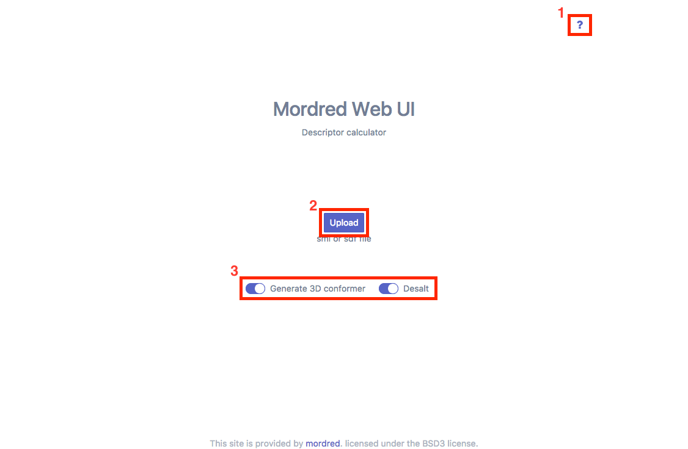
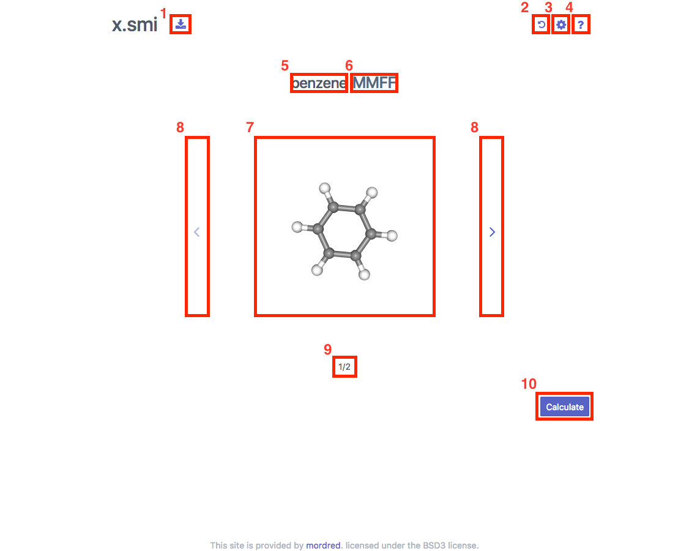
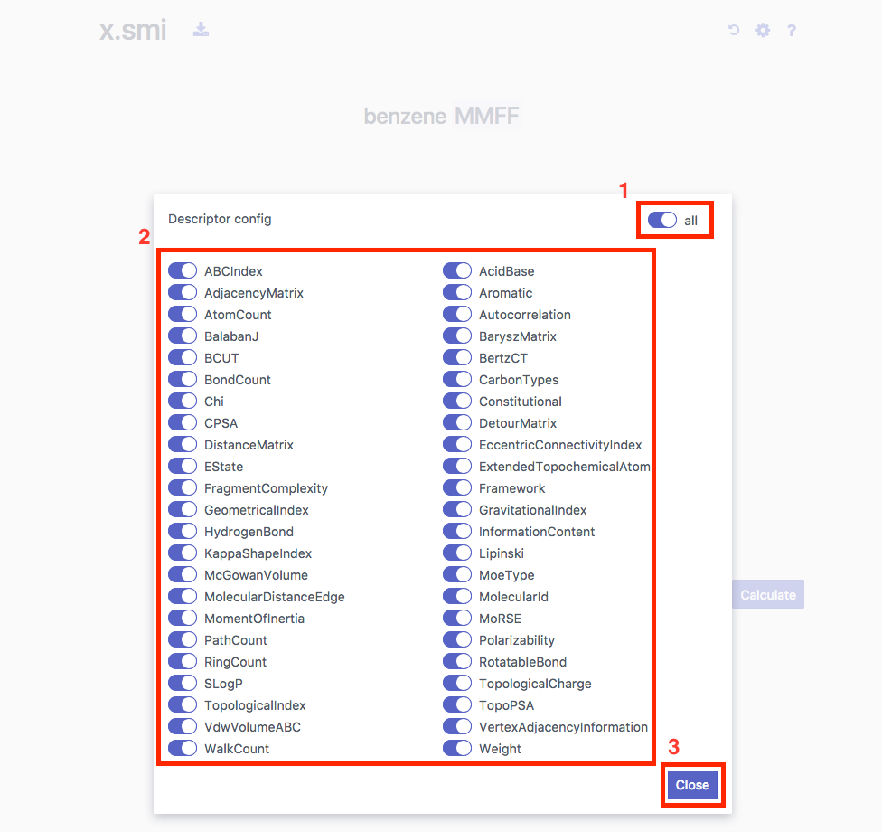
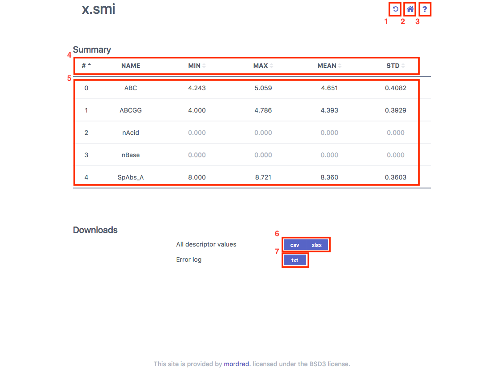

How to use mordred Web UI
==

Top page
--
First, Select preprocessing option from **3**.
Second, click **2** to Upload sdf/smi file (example file: [smi](examples/example.smi), [sdf](examples/example.sdf)).

1. Show this page
2. Select file to upload
3. Preprocessing options

File page
--
First, check molecule structure using **1** or **5** to **9** and configure from **3** (next section).
Second, click **10** to calculate descriptors.

1. Download preprocessed file as smi or sdf file
2. Back to top page
3. Show Configuration modal
4. Show this page
5. Molecular name
6. Force field used by 3D conformer generation (only show when **Generate 3D conformer** option is enabled)
7. Molecular structure (show 2D mode if upload smi and **Generate 3D conformer** option is disabled)

    In 3D mode:

        Drag: Rotate
        Wheel scroll or wheel drag: Zoom
        Right drag: translate
        Mouse hover: show atom/bond information

8. Change next/previous molecule
9. Current molecule index / number of molecule
10. Calculate descriptors of file

Configuration modal
--

1. Enable/disable all descriptors
2. Enable/disable descriptor
3. Close configuration modal

Result page
--

1. Back to File page
2. Back to Top page
3. Show this page
4. Sumary header; Click to sort
5. Summary; vertically scrollable
6. Download all descriptor values as csv or xlsx file
7. Download error log as plain text
